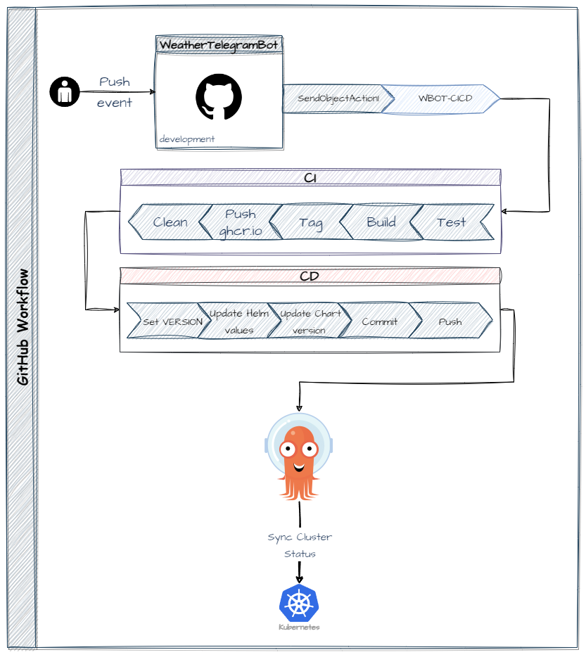

# Weather Telegram Bot

<https://t.me/TheWeatherTelegramBot>

### Local deployment

1. Clone the repository:

   `git clone https://github.com/ruv1000/WeatherTelegramBot.git`

2. Create a new bot using [BotFather](https://t.me/BotFather) on Telegram. Name it as you wish and obtain the `API token`.
3. Create an account on [OpenWeatherMap](https://openweathermap.org/) and generate an `API key`.
4. Inside the root folder of your project create `.env` file and place your API token and API key inside `TELE_TOKEN` and `OWM_API_KEY` variable.
5. Build the project with the command:

   `go build` or `make build`

6. Start the bot:

   `./WeatherTelegramBot start`

### How to use

1. Go to <https://t.me/TheWeatherTelegramBot>
2. Start a dialogue with the bot using

   `/start hello`

3. To check the weather in a specific location, use the command

   `/kbot weather -c <city>`

Example:

    /kbot weather -c Kyiv

### Helm

To install the helm chart:

```zsh
helm install --set secret.tokenKey=<TELEGAM_TOKEN> --set secret.apikey=<OWM_API_KEY> weathertelegrambot https://github.com/ruv1000/WeatherTelegramBot/releases/download/v1.0.6/weathertelegrambot-0.1.0.tgz
```

### Workflow


